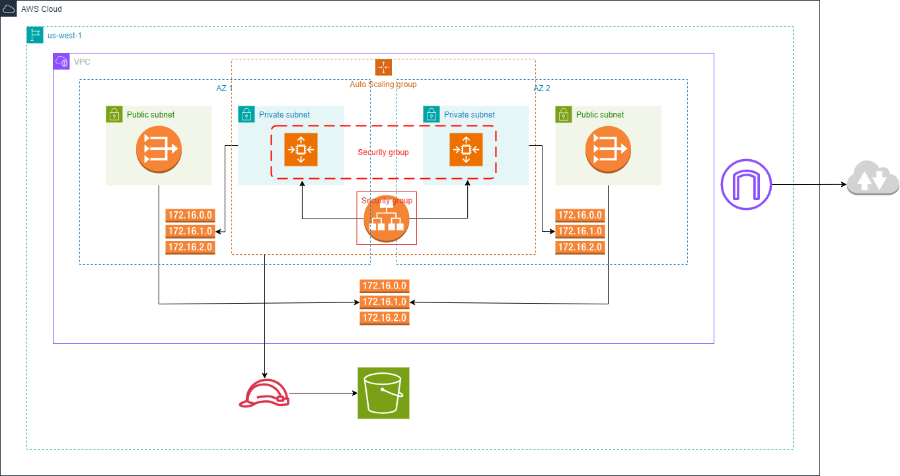
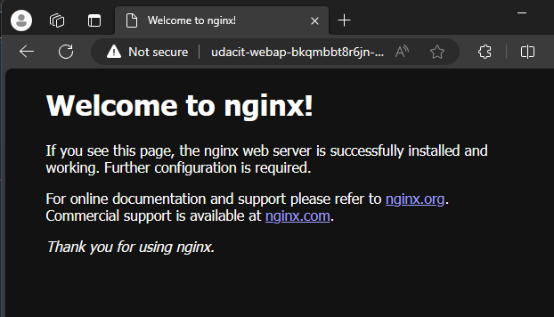
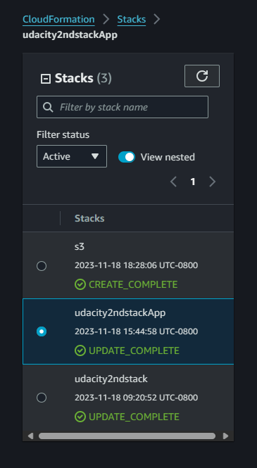
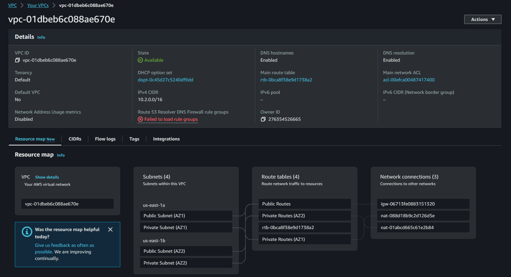
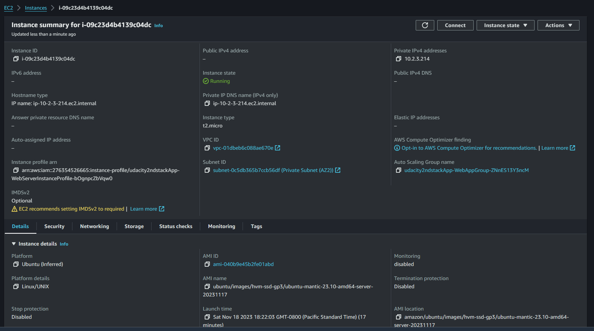
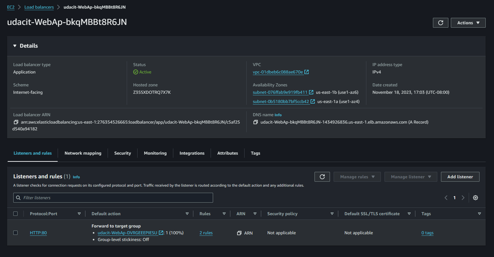
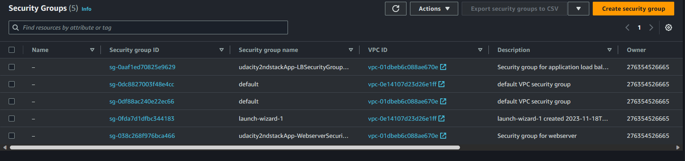
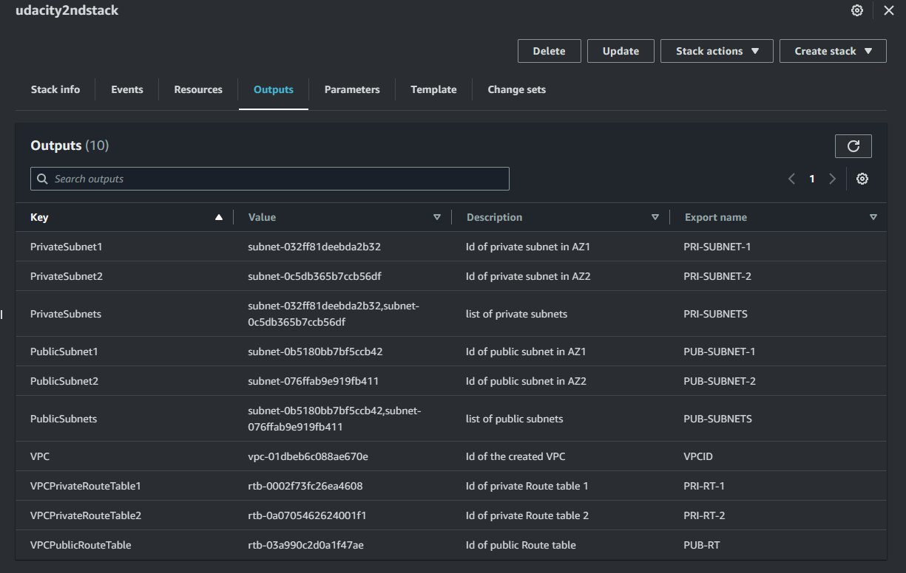

# udacity2nd high-availability web app using CloudFormation

Infrastructure Diagram: 

Outputs: http://udacit-webap-bkqmbbt8r6jn-1434926836.us-east-1.elb.amazonaws.com/

Welcome page:




## script to create s3 bucket 
```
sh starter\createS3.sh s3
```

* Notice: Remember to change bucketname in file `starter\s3-parameters.json` each time running, cause the bucket name must be unique

## script to create/update network

```
sh starter\createNetwork.sh
```
```
sh starter\updateNetwork.sh
```

## script to create/update application
```
sh starter\createApp.sh
```
```
sh starter\updateApp.sh
```

## script to delete stack and resources
```
sh starter\deleteStack.sh <stack-name>
```

* Notice: must update `BucketName` in parameter file `starter\udagram-parameters.json`, make sure bucket is existing.

## Stacks and Resources

* All stacks run success: 



* VPC resource map with Public subnets, Private subnets, Route tables:



* EC2 Instance: 



* Load balancer:



* Security Groups:



* Stack's outputs:


